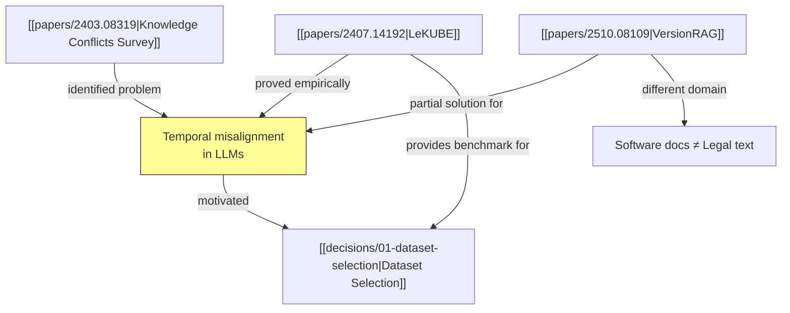
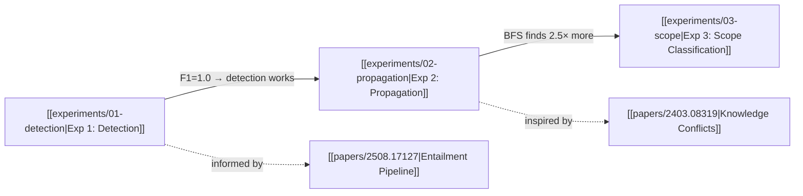

# Knowledge Trace Skill

Write Obsidian-compatible notes that tell the story of your research process. A human should be able to open `knowledge/guide.md` in Obsidian and understand everything — the question, the literature, the experiments, the findings — by reading one continuous narrative with links to deeper details.

## Core Principles

1. **Write prose, not catalogs.** README.md is a blog post, not a list of links.
2. **Interconnect everything.** Wikilinks go THROUGHOUT the text, not in a "Connections" section at the end.
3. **Every note has substance.** 300-800 words of real analysis, not stubs.
4. **Living documents.** When new information changes old conclusions, go back and update previous notes.
5. **Diagrams for complexity.** Use Mermaid when relationships are hard to explain in prose alone.

## Output Directory

```
knowledge/
  README.md              ← THE STORY (main narrative — start here)
  errors.md              ← Structured error log
  papers/
    {arxiv-id}.md        ← One note per paper (linked from the story)
  experiments/
    {number}-{slug}.md   ← One note per experiment (linked from the story)
  decisions/
    {number}-{slug}.md   ← One note per significant decision (linked from the story)
```

## Obsidian Conventions

1. **YAML frontmatter** at the top (between `---` delimiters)
2. **Wikilinks** for cross-references: `[[papers/2401.12345]]` or `[[papers/2401.12345|display text]]`
3. **Tags** in frontmatter (not inline): `tags: [paper, relevant]`
4. **Callouts** for important notes: `> [!warning]`, `> [!tip]`, `> [!note]`
5. **Collapsible callouts** for secondary info: `> [!note]- Title` (collapsed by default)
6. **Mermaid diagrams** in fenced code blocks with `mermaid` language tag

See `references/obsidian-markdown.md` for full syntax reference.

## Quality Standard: What a Good Paper Note Looks Like

This is the quality bar. Every paper note should be this rich and interconnected:

```markdown
---
title: "LeKUBE: A Legal Knowledge Update Benchmark"
tags: [paper, legal-nlp, temporal-knowledge, benchmark]
phase: resource-finder
arxiv: "2407.14192"
authors: "Authors et al."
year: 2024
read-order: 3
relevance: high
decision: use
---

# LeKUBE: A Legal Knowledge Update Benchmark

## Role in the Story
Provides the benchmark that validates our core hypothesis — temporal coherence
in legal knowledge bases is an unsolved problem.

## Summary
LeKUBE tests whether LLMs can reason about updated legal knowledge, specifically
EU legislation. The benchmark captures three types of changes: amendments
(modification of specific provisions), repeals (full invalidation), and new
provisions (additions that may conflict with existing interpretations). What makes
this particularly relevant to our work is the finding that even with RAG, models
frequently cite superseded content alongside current content — exactly the problem
we're trying to solve.

This connects directly to the broader landscape mapped by
[[papers/2403.08319|Xu et al.'s Knowledge Conflicts survey]], which identified
temporal misalignment as the dominant driver of context-memory conflicts but
didn't propose a detection mechanism. LeKUBE proves the problem exists
empirically but doesn't solve the intermediate step of detecting WHICH entries
are superseded — the gap our research fills.

## Key Findings
- LLMs trained before a legal update achieve ~30-40% accuracy on post-update
  questions (parametric knowledge is outdated)
- Even with RAG, models frequently cite superseded document content alongside
  current content — they can't tell which version is authoritative
- Legal supersession is **explicit and structured**: EU Directives explicitly
  state what they repeal, unlike the implicit versioning in
  [[papers/2510.08109|VersionRAG]]'s software documentation domain
- Amendments are hardest: a document might be 90% valid but 10% superseded —
  models fail to identify which 10%
- Human-curated gold standard shows ~85% inter-annotator agreement on
  supersession classification

## Methodology
1. Curated dataset of EU legislation changes (Official Journal of the EU)
2. For each change, generated factual QA pairs about current vs. previous law
3. Tested: (a) zero-shot LLM, (b) RAG with full document set, (c) RAG with
   updated-only documents
4. Baseline: keyword-based supersession detection (searches for "repeals",
   "amends", "replaces")

## Relevance to Our Research
Directly applicable: our hypothesis is a generalization of LeKUBE's problem.
LeKUBE focuses on evaluation (can LLMs answer correctly after updates?), while
we focus on **detection and propagation** (can LLMs automatically identify which
KB entries are invalidated?). Their dataset of ~1,200 QA pairs from EU Official
Journal could serve as our primary evaluation set, which informed
[[decisions/01-dataset-selection|our dataset selection]].

**Key gap LeKUBE leaves open**: it tests end-to-end QA accuracy, not the
intermediate step of detecting which KB entries are superseded. Our research
fills this gap by treating supersession detection and propagation as the
primary tasks.
```

Notice how wikilinks appear naturally throughout the prose — in the Summary, Key Findings, and Relevance sections — not dumped in a "Connections" section at the bottom.

## Mermaid Diagram Examples

### Paper Relationships
````markdown

````

### Experiment Flow
````markdown

````

## README.md — The Main Narrative

Structure:

### Resource Finder writes:
- **The Question**: What we're investigating and why
- **What We Found in the Literature**: Narrative grouped by themes, with Mermaid diagram of paper relationships
- **What We Decided**: Decisions explained IN the story, not as a separate list
- **What's Next**: Clear handoff to the experiment runner

### Experiment Runner appends:
- **The Experiments**: Narrative of what was tested, with Mermaid flow diagram
- **Key Findings**: Synthesis — the big picture, not individual results
- **What Didn't Work**: Honest account of errors and limitations
- **Conclusion**: Was the hypothesis validated?

### Paper Writer reads:
- Uses README.md as the backbone for structuring the paper

## Integration with Pipeline Phases

### During Resource Finder
1. Initialize `knowledge/` directory at the start
2. After reading each paper → delegate paper note to knowledge-tracer
3. When choosing datasets/repos → delegate decision note
4. On errors → delegate error log entry
5. At the end → delegate full narrative README.md

### During Experiment Runner
1. Read `knowledge/guide.md` to understand the story so far
2. After each experiment → delegate experiment note
3. When pivoting approach → delegate decision note
4. On errors → delegate error log entry
5. At the end → delegate narrative continuation (experiments + findings + conclusion)

### During Paper Writer
1. Read `knowledge/guide.md` for the full research story
2. Use the narrative to structure the paper
3. Cross-reference paper notes for Related Work
4. Cross-reference experiment notes for Results
