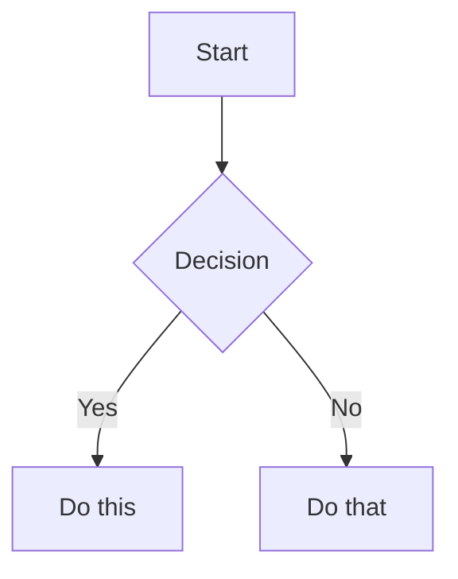

# Obsidian Flavored Markdown Reference

## Properties (Frontmatter)

Properties use YAML frontmatter at the start of a note:

```yaml
---
title: My Note Title
date: 2024-01-15
tags:
  - project
  - important
aliases:
  - My Note
status: in-progress
---
```

## Internal Links (Wikilinks)

```markdown
[[Note Name]]
[[Note Name|Display Text]]
[[Note Name#Heading]]
[[#Heading in same note]]
```

## Callouts

```markdown
> [!note]
> This is a note callout.

> [!info] Custom Title
> This callout has a custom title.

> [!warning]
> Important warning here.

> [!tip]- Collapsed by default
> Hidden content until expanded.
```

### Supported callout types

| Type | Aliases | Color |
|------|---------|-------|
| `note` | - | Blue |
| `abstract` | `summary`, `tldr` | Teal |
| `info` | - | Blue |
| `tip` | `hint`, `important` | Cyan |
| `success` | `check`, `done` | Green |
| `question` | `help`, `faq` | Yellow |
| `warning` | `caution`, `attention` | Orange |
| `failure` | `fail`, `missing` | Red |
| `danger` | `error` | Red |
| `bug` | - | Red |
| `example` | - | Purple |
| `quote` | `cite` | Gray |

## Tags

```markdown
#tag
#nested/tag
#tag-with-dashes

In frontmatter:
---
tags:
  - tag1
  - nested/tag2
---
```

## Diagrams (Mermaid)

````markdown

````

## Embeds

```markdown
![[Note Name]]
![[Note Name#Heading]]
![[image.png]]
![[image.png|300]]
```

## Comments (hidden in reading view)

```markdown
%%This is a hidden comment%%
```
